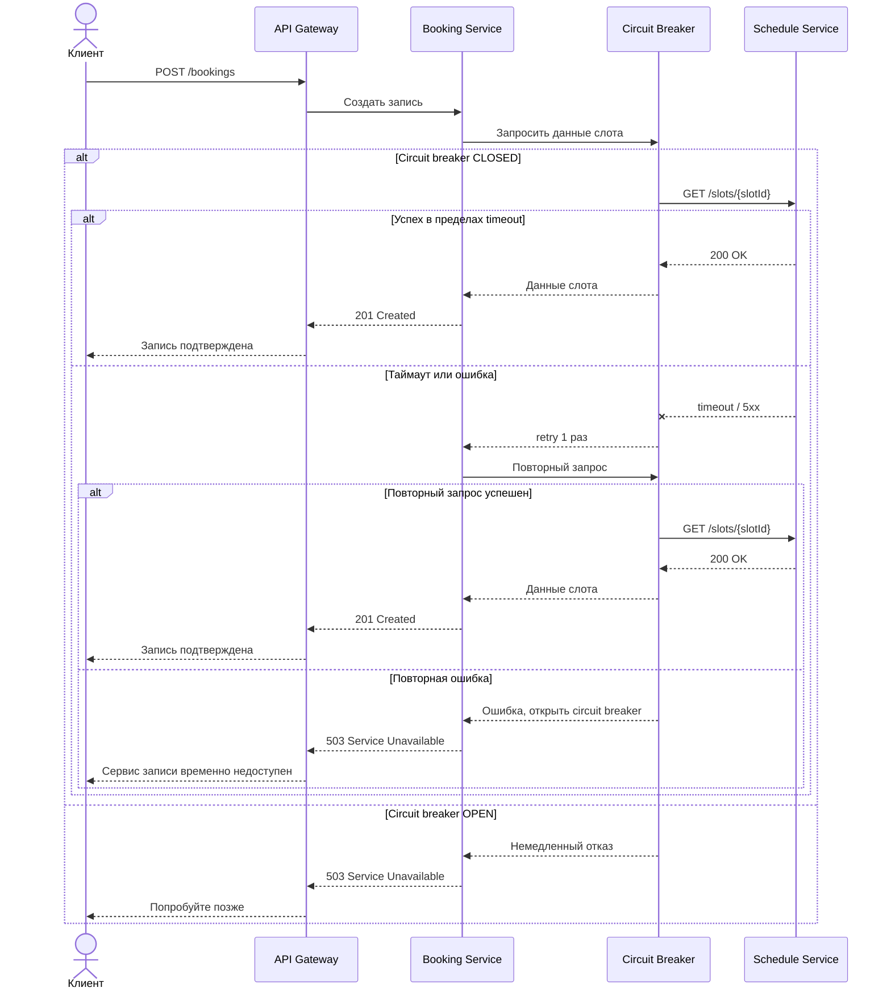

# Лабораторная работа №3

---

## Содержание

| Артефакт | Раздел                                   |
|---|------------------------------------------|
| Контекст проекта | [0](#контекст-проекта)
| План масштабирования | [1](#1-план-масштабирования)
| Карта отказоустойчивости | [2](#2-карта-отказоустойчивости)
| Сценарий нагрузочного теста | [3](#3-сценарий-нагрузочного-теста)
| SLI/SLO для Booking Service | [4](#4-slislo)
| Итоговые архитектурные выводы | [5](#5-итоговые-архитектурные-выводы)

---

## Контекст проекта

В предыдущих работах был спроектирован онлайн-сервис для фитнес-клуба с тремя ролями: клиент, тренер и администратор.
Система поддерживает просмотр расписания, запись на тренировки, управление абонементами, оплату и отправку уведомлений.

Архитектура состоит из следующих контейнеров:
- API Gateway
- Auth Service
- User Service
- Schedule Service
- Booking Service
- Subscription Service
- Payment Service
- Notification Service
- Message Broker

Ключевой бизнес-сценарий системы: клиент записывается на занятие. 
Именно этот сценарий наиболее чувствителен к нагрузке и отказам, потому что требует синхронной проверки свободных мест и статуса абонемента.

То есть основное внимание обратим на **Booking Service**, потому что он:
- участвует в ключевом пользовательском сценарии;
- зависит от других сервисов в реальном времени;
- критичен для пользовательского опыта;
- создаёт доменные события для Notification Service.

---

## 1. План масштабирования

### 1.1 Общий подход

На ранних этапах, можно использовать **вертикальное масштабирование**. Оно проще всего, не требует менять архитектуру и код,
и всё можно реализовать быстро.

Однако позже у фитнес-клуба может сильно вырасти количество филлиалов и клиентов. В какой-то момент расти вертикально, добавляя
новые сервера, станет очень дорого или мы вовсе упремся в физический предел.
Также при росте числа клиентов вырастет и количество одновременных записей. В таком случае необходимо будет сделать:
- **горизонтальное масштабирование** stateless-компонентов; 
- Для источников данных сделать комбинацию **репликации**, **кэширования** и частично **выделения самых нагруженных, самых часто используемых частей системы** (чтение/запись).

Важно учитывать, что:
1) большая часть запросов:
    - чтение расписания
    - просмотр данных
2) наиболее критичные операции:
   - запись на занятие
   - покупка абонемента

### 1.2 Компонент 1: API Gateway

**Как масштабировать:**
- Как временная мера на раннем этапе: **вертикально**
- При росте количества клиентов и запросов: **горизонтально** – запуск нескольких экземпляров Gateway за балансировщиком нагрузки

**Почему именно так** : Gateway не хранит состояние пользователей (всё в токене и сервисах), поэтому можно спокойно запускать несколько копий 
и распределять между ними запросы.

**Узкие места при росте нагрузки:**
- большое количество одновременных запросов;
- час-пики нагрузки (например, все записываются на тренировки вечером);
- нагрузка на HTTPS и обработку запросов;
- если оставить один экземпляр, он станет точкой отказа.

**Что предусмотреть заранее:**
- не хранить состояние внутри Gateway (stateless);
- использовать балансировщик нагрузки;
- настроить health-check, чтобы нерабочие инстансы автоматически отключались;
- заранее предусмотреть запуск нескольких экземпляров.

**Итог:** для API Gateway основной путь роста: горизонтальное масштабирование.

### 1.3 Компонент 2: Booking Service

**Как масштабировать:**
- На первых этапах при небольшой нагрузке – **вертикально**
- при увеличении нагрузки: **горизонтально** – запуск нескольких экземпляров Booking Service за API Gateway

**Почему именно так:**
Booking Service – это центральный сервис, который обрабатывает запись на занятия, то есть основную бизнес-логику проекта.
Нагрузка на него неравномерная: в моменты открытия популярных слотов может возникнуть резкий всплеск запросов.

Сервис можно масштабировать горизонтально, так как он не должен хранить состояние в памяти: все данные хранятся в базе, события в брокере, 
и каждый экземпляр может обрабатывать запросы независимо.

**Узкие места при росте нагрузки:**
- несколько пользователей одновременно пытаются занять одно и то же место;
- зависимость от других сервисов (Schedule, Subscription) увеличивает время ответа;
- конфликты при обновлении количества свободных мест в базе;
- повторные запросы пользователей при ошибках (retry со стороны клиента) создают дополнительную нагрузку.

**Что предусмотреть заранее:**
- идемпотентность: повторный запрос не должен создавать дубликат записи;
- защита от двойного бронирования (транзакции, уникальные ограничения, locking);
- ограничение времени ожидания внешних сервисов (timeout);
- при росте нагрузки переход к локальному хранению данных (кэш или реплика), обновляемых через события;
- разделение операций, чтобы они не конкурировали за ресурсы:
  - чтение (просмотр расписания);
  - запись (создание бронирования),

**Итог:**

Для Booking Service основной путь: горизонтальное масштабирование, но только при условии, что проблема конкурентной 
записи и консистентности решена на уровне БД и контрактов.

### 1.4 Компонент 3: Schedule Service

**Как масштабировать:** 
- на начальных этапах **вертикально по БД** для увеличения ресурсов основной базы
- далее **горизонтально по чтению**: несколько экземпляров сервиса для обработки запросов на просмотр расписания
- **Репликация БД**: использование read-replica для разгрузки чтения

**Почему именно так:**
Schedule Service в основном обслуживает операции чтения.
Пользователи значительно чаще просматривают расписание, чем записываются на занятия. Из-за этого основная нагрузка возникает именно на:
- получение списка занятий;
- фильтрацию и поиск.

Поэтому архитектура должна быть ориентирована на масштабирование чтения, а не записи.

**Узкие места при росте нагрузки:**
- большое количество запросов с фильтрацией (по дате, тренеру, типу занятия);
- перегрузка основной базы, если чтение и запись идут через один источник;
- увеличение времени ответа при сложных запросах;
- конкуренция между пользовательскими запросами и изменениями администратора (редактирование расписания).

**Что предусмотреть заранее:**
- разделить операции:
  - чтение (просмотр расписания);
  - запись (изменения администратором);
- использовать read-replica для всех read-запросов;
- кэшировать популярные выборки (например, расписание на сегодня/завтра);
- ограничить объём данных через пагинацию и фильтры;
- ввести события (`class.updated`, `class.cancelled`), чтобы другие сервисы могли получать изменения без постоянных синхронных запросов.

**Итог:**
Schedule Service масштабируется в первую очередь за счёт чтения:
горизонтальное масштабирование сервиса + репликация и кэширование на уровне данных позволяют выдерживать рост нагрузки без перегрузки основной базы.

### 1.5 Компонент 4: Notification Service

**Как масштабировать:**
- в самом начале можно **вертикально**
- далее **горизонтально**: увеличивать число worker-процессов, читающих события из брокера.

**Почему именно так:**
Notification Service работает асинхронно через брокер сообщений и не участвует в основном пользовательском запросе. 
Это означает, что его можно масштабировать независимо, ориентируясь на нагрузку в очереди.

Каждый воркер обрабатывает события (например, `booking.created`) и отправляет уведомления, поэтому увеличение числа 
воркеров напрямую увеличивает пропускную способность сервиса.

**Узкие места при росте нагрузки:**
- резкий рост числа событий (например, массовая запись или отмена занятий);
- ограничения со стороны внешнего провайдера (rate limit);
- накопление сообщений в очереди при замедлении или недоступности внешнего API;
- рост времени доставки уведомлений.

**Что предусмотреть заранее:**
- масштабировать количество воркеров независимо от остальных сервисов;
- использовать retry с задержкой (backoff) при ошибках внешнего провайдера;
- настроить dead-letter queue для сообщений, которые не удалось обработать;
- отслеживать глубину очереди (queue depth) и использовать её как сигнал для масштабирования;
- ограничивать скорость отправки (rate limiting), чтобы не превышать лимиты провайдера.

**Итог:**
Notification Service масштабируется горизонтально через увеличение числа воркеров.
Ключевой фактор – длина очереди: чем она больше, тем больше воркеров требуется для поддержания стабильной обработки событий.

### 1.6 Архитектурные узкие места при росте нагрузки

Ниже перечислены главные узкие места системы в целом.

| Узкое место                                          | Почему возникает | Последствие |
|------------------------------------------------------|---|---|
| Синхронные вызовы Booking –> Schedule / Subscription | Запись зависит от доступности и скорости двух сервисов | Рост latency, каскадные отказы |
| Основная БД расписания                               | Большой поток чтения и административных обновлений | Перегрузка, рост времени ответа |
| Конкурентная запись на один слот                     | Популярные занятия вызывают борьбу за одни и те же места | Двойные бронирования, конфликты, ошибки |
| Внешний платёжный шлюз                               | Не контролируется командой системы | Задержки, ошибки оплаты |
| Внешний провайдер уведомлений                        | Ограничения по скорости и доступности | Рост очередей, задержка уведомлений |

### 1.7 Что стоит предусмотреть заранее

1) Stateless-сервисы (Gateway и backend): сервисы не должны хранить состояние в памяти. Это необходимо, чтобы можно было 
    без проблем запускать несколько экземпляров и масштабироваться горизонтально.
2) Разделение чтения и записи для расписания: использовать read-replica и кэш, чтобы массовые запросы на просмотр расписания не перегружали основную базу и не мешали операциям записи.
3) Идемпотентность критических операций, так как повторные запросы (например, при retry) не должны создавать дублирующие записи или ломать данные.
4) Таймауты и ограничения на межсервисные вызовы: каждый вызов к другому сервису должен иметь ограничение по времени, чтобы при сбое зависимый сервис не блокировал основной поток.
5) Асинхронная обработка вторичных задач, то есть всё, что не влияет напрямую на ответ пользователю (уведомления, аналитика, фоновые процессы), должно выполняться через события и очереди.
6) Мониторинг ключевых метрик. Необходимо отслеживать:
- глубину очередей (queue depth),
- задержку (latency),
- ошибки (error rate),
- загрузку ресурсов (saturation).

    Без этого невозможно понять, где система начинает деградировать и когда нужно масштабироваться.

---

## 2. Карта отказоустойчивости

### 2.1 Общий принцип

Для рассматриваемой системы отказоустойчивость строится по правилу:
- критичный пользовательский поток должен либо завершаться успешно,
- либо завершаться быстро и предсказуемо,
- а некритичные действия должны выполняться асинхронно и не ломать основной сценарий.

### 2.2 Критическая точка отказа 1: Schedule Service недоступен при записи

| Параметр | Описание                                                                                                                          |
|---|-----------------------------------------------------------------------------------------------------------------------------------|
| Компонент | Booking Service –> Schedule Service                                                                                               |
| Тип сбоя | Сетевой сбой / таймаут / программный сбой соседнего сервиса                                                                       |
| Риск | Нельзя проверить наличие мест, операция записи зависает или завершается слишком долго                                             |
| Защитный механизм | Timeout + retry + circuit breaker                                                                                                 |
| Поведение | При коротком сбое выполняется ограниченный retry; при серии сбоев размыкается circuit breaker и клиент быстро получает понятную ошибку |

При этом, проверка наличия мест – критическая операция, поэтому:
- retry должен быть ограниченным (1–2 попытки);
- timeout – коротким;
- при длительном сбое система должна быстро "сдаться", а не зависать.

### 2.3 Критическая точка отказа 2: Message Broker недоступен или не принимает события

| Параметр | Описание                                                                                                                                               |
|---|--------------------------------------------------------------------------------------------------------------------------------------------------------|
| Компонент | Booking Service –> Message Broker                                                                                                                      |
| Тип сбоя | Сетевой сбой / перегрузка брокера / инфраструктурная проблема                                                                                                      |
| Риск | Событие о создании записи не публикуется, уведомление не отправляется                                                                                  |
| Защитный механизм | Retry + durable queue + publisher confirm / acknowledgement                                                                            |
| Поведение | Основная операция записи завершается независимо, а событие либо доставляется, либо сохраняется для повторной отправки |

Ошибка публикации события не должна ломать основной сценарий (запись уже создана),
но система обязана:
- избегать потери событий;
- гарантировать повторную отправку.

### 2.4 Критическая точка отказа 3: внешний платёжный шлюз недоступен

| Параметр | Описание                                                                                                                                                                                                                    |
|---|-----------------------------------------------------------------------------------------------------------------------------------------------------------------------------------------------------------------------------|
| Компонент | Payment Service –> Внешний платёжный шлюз                                                                                                                                                                                   |
| Тип сбоя | Сбой внешнего API / сетевой сбой / высокие задержки                                                                                                                                                                         |
| Риск | Пользователь не может купить или продлить абонемент                                                                                                                                                                         |
| Защитный механизм |Timeout + circuit breaker + fallback                                                                                                                                                                                         |
| Поведение | При кратком сбое выполняются ограниченные попытки; при системной проблеме включается circuit breaker, а пользователю показывается управляемый отказ: "оплата временно недоступна, попробуйте позже или используйте другой способ" |

Здесь fallback не заменяет саму оплату, а даёт graceful degradation интерфейса, чтобы не блокировать всю систему и не вводить пользователя в заблуждение.
То есть присутствует понятное сообщение пользователю

### 2.5 Критическая точка отказа 4: перегрузка БД Booking Service

| Параметр | Описание                                                                                              |
|---|-------------------------------------------------------------------------------------------------------|
| Компонент | Booking Service –> Booking DB                                                                         |
| Тип сбоя | Перегрузка ресурсов / блокировки / рост времени ответа (latency)                                      |
| Риск | Ошибки записи, двойные бронирования, резкий рост времени ответа                                       |
| Защитный механизм | Replica для чтения + ограничение конкуренции + блокировки на запись (optimistic/pessimistic)
| Поведение | Чтение выносится отдельно, а операции записи защищаются от конфликтов и гонок

В этом случае отказоустойчивость это не только доступность, но и корректность данных.
Важно не просто принять запрос, а гарантировать, что:
- одно место не будет продано дважды;
- данные останутся согласованными даже под нагрузкой.

### 2.6 Схема обработки отказа: Booking Service защищается от недоступности Schedule Service

### 2.7 Итоговая карта механизмов защиты

| Точка отказа              | Тип сбоя | Защитный механизм | Почему подходит |
|---------------------------|---|---|---|
| Booking –> Schedule       | Сетевой/программный | timeout + retry + circuit breaker | Позволяет быстро обнаружить недоступность и не допустить каскадного зависания |
| Booking –> Message Broker | Инфраструктурный | retry + durable queue + ack | Снижает риск потери событий |
| Payment –> Платёжный шлюз | Внешняя зависимость | timeout + circuit breaker + fallback | Даёт контролируемую деградацию при недоступности внешнего API |
| Booking DB                | Насыщение / блокировки | replica + защита write-пути | Обеспечивает доступность чтения и корректность записи |

---

## 3. Сценарий нагрузочного теста

### 3.1 Выбранный компонент

Для нагрузочного тестирования выбран **Booking Service**, так как он:
- находится в центре ключевого пользовательского сценария (запись на занятие);
- зависит от нескольких сервисов (Schedule, Subscription);
- чувствителен к конкурентной нагрузке и консистентности данных.

### 3.2 Сценарий

Сценарий: массовая запись пользователей на популярное групповое занятие
(например, вечерний слот с ограничением в 15 мест).

Это реалистичная ситуация для домена:
- запись открывается в определённый момент времени;
- популярные тренеры вызывают повышенный спрос;
- несколько пользователей одновременно пытаются занять ограниченное число мест.

В результате возникает высокая конкуренция за один и тот же ресурс.

### 3.3 Тип нагрузки

Несколько типов нагрузки:

- RPS-нагрузка: для оценки устойчивой пропускной способности сервиса;
- пиковая нагрузка: имитация момента открытия записи;
- burst-нагрузка: резкий всплеск запросов на один слот за короткое время;
- latency-sensitive сценарий: пользователь ожидает быстрый ответ, так как результат (получил место или нет) важен в реальном времени.

### 3.4 Цель теста

Цель тестирования – оценить поведение системы в условиях конкурентной записи:
- выявить узкие места (в сервисе, БД или внешних зависимостях);
- оценить рост задержек (latency) при увеличении числа параллельных запросов;
- проверить корректность работы:
- отсутствие двойного бронирования;
- корректное распределение ограниченных мест;
- проанализировать деградацию системы при замедлении зависимых сервисов (Schedule Service, Subscription Service).

Тестирование проводится в несколько этапов, каждый из которых проверяет отдельный аспект поведения системы:

#### Этап A: baseline (нормальная нагрузка)
- Постепенно увеличивается нагрузка до уровня, соответствующего обычной работе.
- Проверяется, что система стабильно обрабатывает запросы без роста ошибок и задержек.

#### Этап B: spike (резкий всплеск)
- Одновременно отправляется большое количество запросов на один и тот же `slotId`.
- Проверить поведение системы при высокой конкуренции за ограниченный ресурс.

#### Этап C: degraded dependency (деградация зависимых сервисов)
- Искусственно увеличить задержку ответов Schedule Service или Subscription Service.
- Проверить, срабатывают ли timeout, retry и circuit breaker.

| Этап | Нагрузка                                       | Длительность | Назначение                                           |
|---|------------------------------------------------|---|------------------------------------------------------|
| Baseline | 30–50 RPS                                      | 10 минут | Проверить стабильную работу в нормальном режиме      |
| Peak | 100–150 RPS                                    | 5 минут | Анализ роста latency и ошибок при увеличении нагрузки |
| Burst на один слот | до 200 конкурентных запросов на один `slotId`  | 1–2 минуты | Проверка конкурентной записи и поиск конфликтов         |
| Dependency degradation | 50 RPS + задержка 1-2 сек на зависимом сервисе | 5 минут | Проверить корректную деградацию и защитные механизмы |

### 3.5 Ключевые метрики теста

| Метрика | Что показывает                                         | Зачем нужна |
|---|--------------------------------------------------------|---|
| **Throughput** | Количество успешно обработанных бронирований в секунду | Оценить реальную пропускную способность сервиса |
| **Latency (p50 / p95 / p99)** | Время ответа на запрос записи                          | Оценить пользовательский опыт и деградацию |
| **Error rate** | Доля неуспешных запросов                               | Определить границу, после которой система начинает давать сбои |
| **Conflict rate** | Доля конфликтов при записи на один слот                | Проверить корректность обработки конкурентных запросов и защиту от гонок |
| **Timeout rate на зависимых вызовах** | Частота таймаутов при обращении к другим сервисам    | Оценить влияние внешних зависимостей на стабильность системы |
| **CPU / Memory saturation** | Насыщение ресурсов Booking Service                     | Понять, когда нужно масштабирование |

Набор метрик охватывает:
- производительность (throughput, latency),
- надёжность (error rate, timeout rate),
- корректность логики (conflict rate),
- ресурсные ограничения (saturation).

Это позволяет не только измерить нагрузку, но и понять причины деградации системы.

---

## 4. SLI/SLO

Выбранный сервис: **Booking service**

### 4.1 Почему выбран именно Booking Service

Booking Service – это ключевой бизнес-компонент системы.
Если просмотр расписания может частично деградировать без критичных последствий, то невозможность создать запись напрямую 
влияет на пользовательский опыт и ценность продукта.
Поэтому именно для этого сервиса необходимо задать измеримые показатели качества и контролировать их выполнение.

### 4.2 Выбранные SLI

#### SLI 1 – Availability
**Определение:** доля запросов `POST /bookings`, для которых сервис был доступен и смог вернуть ответ.

**Что измеряем:**
- все ответы, полученные в пределах таймаута (2xx и ожидаемые бизнес-ответы 4xx);
- ошибки уровня 5xx и таймауты считаются недоступностью сервиса.

#### SLI 2 – Latency p95
**Определение:** 95-й перцентиль времени ответа на запрос `POST /bookings`.

**Что измеряем:**
- полный путь обработки запроса: от поступления в систему до возврата ответа клиенту;
- учитываются все этапы, включая обращения к зависимым сервисам.

#### SLI 3 – Error Rate (доля технических ошибок)
**Определение:** доля запросов `POST /bookings`, завершившихся техническими ошибками.

**Что измеряем:**
- ошибки уровня 5xx;
- инфраструктурные ошибки и таймауты;
- бизнес-ответы (например, `409 no_available_slots`) не считаются ошибками, так как это корректный результат работы системы.

#### SLI 4 – Booking Correctness
**Определение:** доля слотов, для которых число подтверждённых записей не превысило число доступных мест.

**Что измеряем:**
- число подтверждённых записей не превышает доступное количество мест;
- отсутствие double booking и нарушений бизнес-инвариантов.

#### Итог по выбранным SLI:
Выбранные SLI покрывают ключевые аспекты качества сервиса:
- доступность (Availability),
- производительность (Latency),
- надёжность (Error Rate),
- корректность бизнес-логики (Booking Correctness).

### 4.3 Целевые SLO

| SLI | SLO | Обоснование                                                                                                  |
|---|---|--------------------------------------------------------------------------------------------------------------|
| Availability | не ниже 99.5% в месяц | Для фитнес-сервиса нужен высокий, но реалистичный уровень доступности                                        |                                         |
| Latency p95 | не более 800 мс для `POST /bookings` | Учитывает сетевые задержки и два синхронных вызова, оставаясь в пределах комфортного пользовательского опыта |
| Error Rate | не более 1% технических ошибок за 15 минут наблюдения | Позволяет рано замечать деградацию зависимостей и инфраструктуры                                             |
| Booking Correctness | 100% подтверждённых записей не больше вместимости слота | Жёсткое бизнес-требование, а не "желательное" количество                                                     |

#### 1. Availability
Значение 99.5% соответствует уровню доступности, достаточному для пользовательского сервиса без жестких требований уровня банковских систем.
Более высокий уровень (например, 99.95%) потребовал бы:
- дополнительной репликации;
- более сложной изоляции зависимостей;
- увеличения инфраструктурных затрат.

В сервисе записи на занятия в фитнес-клубе в этом нет необходимости

#### 2. Latency p95
Операция записи включает несколько последовательных этапов:
- обработку запроса через API Gateway;
- синхронные вызовы Schedule Service и Subscription Service;
- запись в базу данных.

С учётом этого требование в диапазоне 200–300 мс для p95 было бы нереалистичным.
Значение 800 мс учитывает сетевые и инфраструктурные задержки, а так же сохраняет ощущение быстрого ответа для пользователя.

#### 3. Error Rate
Если техническая ошибка превышает 1%, это уже заметная деградация для массового сценария записи.

#### 4. Booking Correctness
Для операций бронирования корректность имеет приоритет над всеми остальными метриками.
Даже единичный случай, когда количество подтверждённых записей превышает вместимость, означает нарушение основного 
бизнес-инварианта и недопустим с точки зрения системы, так как места в фитнес-залах обычно просто строго ограничены физически
и запись сверх лимита может сильно испортить пользовательский опыт (клиент может не получить услугу, так как не поместится в зал)

#### Итог:
Выбранные SLO отражают баланс между:
- качеством пользовательского опыта,
- техническими ограничениями архитектуры,
- стоимостью реализации.

### 4.4 Как SLO влияют на архитектурные решения

| SLO | Архитектурное последствие                                                                                                |
|---|--------------------------------------------------------------------------------------------------------------------------|
| Высокая availability | Нужны несколько экземпляров Gateway и Booking Service, health-check и быстрые таймауты                                   |
| Ограничение latency p95 | Необходимо минимизировать длину синхронных цепочек и контролировать retry (ограниченное число попыток, короткий backoff) |
| Низкий error rate | Нужны circuit breaker, мониторинг зависимостей и управляемая деградация                                                  |
| 100% booking correctness | Необходимы гарантии на уровне данных: транзакции, защита от гонок, идемпотентность операций                                                        |

---

## 5. Итоговые архитектурные выводы

В результате анализа для данного проекта можно сделать следующие выводы:

### 5.1 По масштабированию
- API Gateway, Booking Service и Notification Service должны проектироваться как stateless-компоненты и масштабироваться горизонтально.
- Schedule Service требует отдельного внимания к read-heavy-нагрузке: нужны кэширование и read replicas.
- Для источников данных рост нагрузки упрётся не только в CPU сервисов, но и в корректную организацию чтения/записи и межсервисных зависимостей.

### 5.2 По отказоустойчивости
- Основной риск для главного пользовательского сценария это синхронные зависимости Booking Service.
- Для таких зависимостей необходимы timeout, ограниченный retry и circuit breaker.
- Для асинхронного контура уведомлений важнее всего не скорость, а сохранность события: нужны подтверждения доставки и механизм повторной обработки.
- Для внешнего платёжного шлюза необходима управляемая деградация через fallback-сценарий на уровне UX.

### 5.3 По нагрузке
- Самый важный тест – это конкурентная запись на один и тот же слот.
- Узкое место вероятнее всего проявится в write-контуре Booking DB и в задержках зависимых сервисов.
- Без измерения p95/p99 latency, error rate и conflict rate невозможно доказать устойчивость архитектуры.

### 5.4 По качеству
- Для Booking Service метрики качества должны фиксировать не только скорость и доступность, но и корректность бизнес-инвариантов.
- SLI/SLO в этом проекте напрямую влияют на архитектурные решения: таймауты, реплики, кэширование, защита от гонок, масштабирование и границы деградации.

