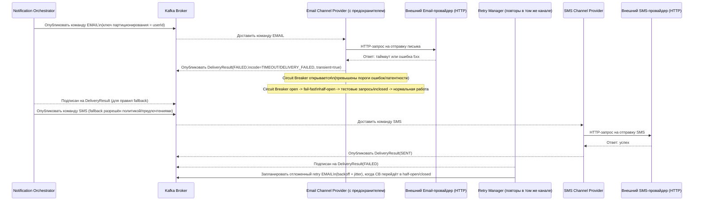

# Лабораторная работа №3 (к занятию 5)

# Notification Service

## 1. План масштабирования

1) Inbound Event Listener + Notification Orchestrator

- Масштабирование
    - Горизонтально: несколько инстансов Notification Service в одной consumer group топика DomainEvent; параллелизм
      ограничен числом партиций.
    - Вертикально: увеличение CPU/heap при усложнении бизнес-правил.
- Узкие места:
    - Недостаточное число партиций ограничит пропускную способность.
    - Потеря порядка событий для одной сущности при неверном ключе партиционирования.
- Изменения, которые стоит заложить:
    - Политика ключей партиционирования DomainEvent: user-centric типы - key=userId; event-centric - key = eventId; при
      multi-tenant - опционально key = hash(tenantId + eventId).
    - Полная stateless-реализация оркестратора и идемпотентность по ключу для безопасного горизонтального
      масштабирования.
    - Возможность вынесения Routing Policy Engine в отдельный модуль без изменения контрактов.

2) Channel Provider

- Масштабирование:
    - Горизонтально: отдельный топик команд для данного канала, своя consumer group; увеличение числа
      инстансов/воркеров.
    - Вертикально: увеличение сетевых/IO ресурсов и размеров connection pool/клиента к внешнему провайдеру.
- Узкие места:
    - Ограничения и латентность внешнего провайдера (429/5xx/timeout/ошибки SDK).
    - Неверно настроенные лимиты параллелизма и таймауты вызывают увеличение доли очень медленных операций (редкие, но
      большие задержки).
- Изменения, которые стоит заложить:
    - Отдельные thread/connection pools, явные таймауты (connect/read), rate limiting и автоматическое отключение
      интеграции при частых ошибках (circuit breaker).
    - Ключ партиционирования SendNotificationCommand: по умолчанию key = idempotencyKey (notificationId + channel) для
      сохранения порядка попыток одной нотификации в рамках канала.
    - Возможность выделить «тяжелые» каналы в отдельный пул инстансов того же артефакта (feature-flag на подписку
      конкретных каналов).

3) Template Service

- Масштабирование:
    - Горизонтально: вместе с инстансами сервиса.
    - Вертикально: CPU/память под рендеринг.
- Узкие места:
    - CPU-bound рендеринг и повторная компиляция шаблонов.
- Изменения, которые стоит заложить:
    - Версионированное хранилище шаблонов (источник истины), локальный кэш компилированных шаблонов (LRU+TTL),
      предразогрев кэша.
    - Асинхронная инвалидация кэша (по событиям обновления).
    - Политики таймаутов рендеринга и ограничение размера переменных.

---

## 2. Карта отказоустойчивости

1) Сбой внешнего провайдера канала (Email/SMS/Push)

- Типы сбоев: 429 (rate limit), 5xx, timeout, сетевые ошибки.
- Защита:
    - Circuit breaker в Channel Provider; таймауты connect/read; ограничение общего времени запроса.
    - Retry с экспоненциальным backoff и jitter в пределах лимитов.
    - Fallback на альтернативный канал (если разрешено правилами и предпочтениями), решение принимает Orchestrator.
    - Изоляция по каналам (bulkhead): раздельные топики/лимиты параллелизма.
- Наблюдаемость: коды ошибок (429/5xx/timeout), latency p50/p95/p99, состояние breaker, счетчик ретраев/сообщение.

2) Деградация Kafka

- Типы сбоев: недоступность партиций/брокеров, рост consumer lag.

- **Последствия для системы:**

    - Накопление сообщений в топиках -> рост задержки доставки
    - Замедление обработки событий -> деградация всей системы уведомлений
    - Возможные повторные доставки сообщений при сбоях consumer’ов
- Защита:
    - Репликация Kafka: RF=3 - каждая партиция хранится на трёх брокерах. В сочетании с min.insync.replicas=2 и acks=all
      продьюсер считает запись успешной только когда минимум два брокера подтвердили приём. Это позволяет пережить отказ
      одного брокера без потери данных и сохранить согласованность.
    - Автомасштабирование консюмеров по отставанию (consumer lag): если отставание по партиции стабильно превышает
      порог (например, > N сообщений в течение M минут), автоматически добавляем экземпляры сервиса/воркеры. Когда lag
      снижается - постепенно уменьшаем количество экземпляров. Это предотвращает рост очереди и стабилизирует задержки.
    - DLQ (dead-letter queue): сообщения, которые невозможно обработать (повреждённые, невалидные) или исчерпавшие лимит
      повторных попыток, отправляются в отдельный «мёртвый» топик. Это разгружает основную обработку и позволяет
      разбирать проблемные сообщения отдельно: анализировать причины, исправлять данные и, при необходимости,
      переотправлять.
    - Идемпотентность сервиса для обработки возможных дубликатов.
- Наблюдаемость: consumer lag, частота ребалансов, ошибки/ретраи продьюсера.

3) Ошибки рендеринга (Template Service)

- Типы сбоев: TEMPLATE_NOT_FOUND, RENDERING_FAILED, таймаут рендеринга.
- Защита:
    - Валидация и версионирование шаблонов, локальный кэш компиляции.
    - Таймаут рендеринга; при разрешении политикой - дефолтный текстовый шаблон; иначе отправляем в DLQ.
- Наблюдаемость: доля ошибок рендеринга по типам, p95 латентности рендеринга, cache hit ratio.

Схема (пример: деградация провайдера e-mail; применяются повторы, предохранитель (circuit breaker) и fallback в
Orchestrator)

---

## 3. Сценарий нагрузочного теста

Компонент: Email Channel Provider.

Допущения (согласованы с ЛР1 и ADR по Kafka):

- Пиковый поток DomainEvent: до 10 000 событий/сек
- Конверсия событий в уведомления: около 40%.
- Доля email среди уведомлений: около 60%.
- Оценка целевого пика по email-командам: ~ 0.4 × 0.6 × 10k ≈ 2 400 команд/сек (для пиков).

### Тип нагрузки и профиль

- **Цель теста: валидация работы системы при нагрузке до x3 от расчетного пика (≈ 7 000 команд/сек)**

- Ступенчатая нагрузка на топик команд email:
    - 10 мин: 1 000 команд/сек
    - 10 мин: 2 500 команд/сек
    - 10 мин: 5 000 команд/сек
    - 10 мин: 7 000 команд/сек
    - 15 мин: возврат к 1 000 команд/сек
- Ответы провайдера (эмуляция): 92% 2xx, 5% 429, 3% 5xx/timeout.
- Латентность провайдера (эмуляция): p95 ≈ 600–900 мс, хвосты до 2–3 сек

Цели теста

- Определить порог, после которого растут latency p95/p99 и consumer lag.
- Проверить корректность механизмов защиты при деградации: срабатывание rate limiter/circuit breaker, поведение retry,
  идемпотентность.
- Оценить время осушения бэклога после 5-минутного пика 3 000 команд/сек

Конфигурация

- Топик email.commands: 16 партиций, RF=3; ключ партиционирования = idempotencyKey (notificationId+EMAIL).
- Инстансы Notification Service: 4 (на старте) с возможностью автоскейла до 8.
- Конкурентность Email-воркеров: 4/инстанс
- HTTP pool к провайдеру: ~150 соединений/инстанс; таймауты connect=200 мс, read=2 сек
- Автомасштабирование (по consumer lag): при lag/partition > 600 в течение 2 мин - +1 инстанс (до 8); даунскейл при
  стабильно малом lag.

Ключевые метрики

- Throughput: обработанные команды/сек (успехи + ретраи).
- Latency: p50/p95/p99 «получили команду из Kafka и приняли решение по попытке (успех/ретрай/DLQ)».
- Error rate: доля 429, 5xx, timeout, отдельно бизнес-ошибок (INVALID_RECIPIENT - вне расчета надежности).
- Kafka consumer lag: по email.commands и retry-топикам.
- Backlog drain time: время снижения lag до < 1 000 сообщений после возврата к baseline.
- Circuit breaker: открытия/закрытия, доля fail-fast запросов.
- Retries per message: распределение по попыткам.

Критерии принятия

- На 2 500 команд/сек: p95 ≤ 1.2 s; p99 ≤ 3.0 s; error rate (без бизнес-4xx) ≤ 0.5%; consumer lag стабилен (< ~8 000
  суммарно, < ~500 на партицию).
- После 5-минутного пика 3 000 команд/сек при возврате к 1 000 команд/сек и автоскейле до 6–8 инстансов backlog drain
  time ≤ 15 минут.
- Дубликаты на стороне получателя отсутствуют (идемпотентность по idempotencyKey/notificationGroupId).

---

## 4. SLI/SLO-метрики (Email Channel Provider)

### Границы измерения

- Компонентный уровень (внутренний SLO): от получения SendNotificationCommand в consumer до фиксации результата
  попытки (успех/ретрай/DLQ). Это контролируемая нами часть.
- End-to-end доставка до пользователя зависит от внешнего провайдера и не входит в эти SLO; мониторится отдельно.

### Предполагаемый SLA (для обоснования SLO)
- ≥ 99.5% уведомлений доставляются пользователю
- p99 latency доставки ≤ 5 секунд

Разделение бюджета задержки (latency budget):

| Этап                     | Бюджет |
|--------------------------|--------|
| Orchestrator             | ~1.5 с |
| Channel Provider (наш)   | ~3.0 с |
| Внешний провайдер        | ~0.5 с |

Далее SLO компонента выводятся из этого бюджета.

### SLI и SLO

1) Delivery Success Rate (component-level)

- SLI: SENT / (SENT + FAILED_transient + FAILED_permanent). Бизнес-ошибки (например, INVALID_RECIPIENT) исключаем из
  расчёта.
- SLO: ≥ 99.0% среднее за 30 дней.
- Обоснование:
    - Из SLA системы: ≥ 99.5% успешной доставки.
    - Часть ошибок находится вне контроля компонента (внешний провайдер, сеть), закладываем на них ~0.5%.
    - Тогда на наш компонент остаётся допустимый бюджет ошибок ≈ 0.5–1.0%.
    - Значение 99.0% выбрано как нижняя граница, при которой деградация компонента будет обнаружена до нарушения SLA,
      но без избыточных алертов.

2) Processing Latency p95/p99 (component-level)

- SLI: p95/p99 времени обработки одной команды (с чтения из Kafka до принятия решения по попытке: успех/ретрай/DLQ).
- SLO: p95 ≤ 1.2 секунды; p99 ≤ 3.0 секунды (в рабочее время).
- Обоснование:
    - SLA системы: p99 ≤ 5 секунд.
    - Бюджет компонента: ≤ 3 секунд (см. разбиение выше).
    - Следовательно, p99 компонента не может превышать 3 секунды, иначе SLA системы будет нарушен.
    - Значение p95 ≤ 1.2 секунды выбрано как ранний индикатор деградации: при росте p95 можно обнаружить проблему до
      выхода p99 за границу SLO.

3) Backlog Drain Time

- SLI: время, за которое отставание (consumer lag) по командному топику снижается до < 1 000 сообщений после возврата
  нагрузки к обычному уровню.
- SLO: ≤ 15 минут для профиля нагрузки из раздела 3.
- Обоснование:
    - Метрика отражает способность системы восстанавливаться после пиков нагрузки (resilience).
    - Значение SLO выбрано на основе профиля нагрузки из раздела 3: при заданной пиковой нагрузке и пропускной
      способности системы backlog должен быть обработан быстрее, чем возникает новый пик.
    - Связь с картой отказоустойчивости:
        - сценарии деградации (отказ инстансов, временная недоступность провайдера) приводят к росту lag;
        - SLO фиксирует допустимое время восстановления после таких событий.
    - Нагрузочное тестирование используется для валидации этого SLO: моделируются пиковые нагрузки и отказоустойчивые
      сценарии (из карты отказов), измеряется фактическое время “осушения” backlog.

4) Availability (consumer availability)

- SLA: сервис доступен ≥ 99.9% времени.
- SLI: доля времени за месяц, когда есть активные consumer’ы с назначенными партициями и выполняется обработка.
- SLO: ≥ 99.9% за месяц.
- Обоснование:
    - При снижении доступности ниже 99.9% происходит накопление lag, что приводит к нарушению SLO по latency и backlog.
    - Таким образом, availability является базовым ограничением, необходимым для выполнения остальных SLO.
